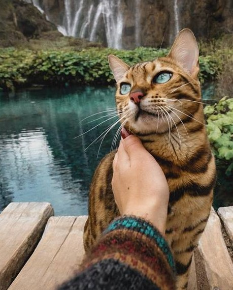
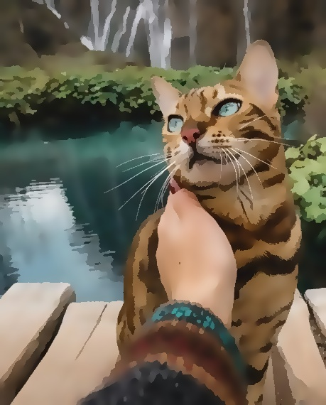
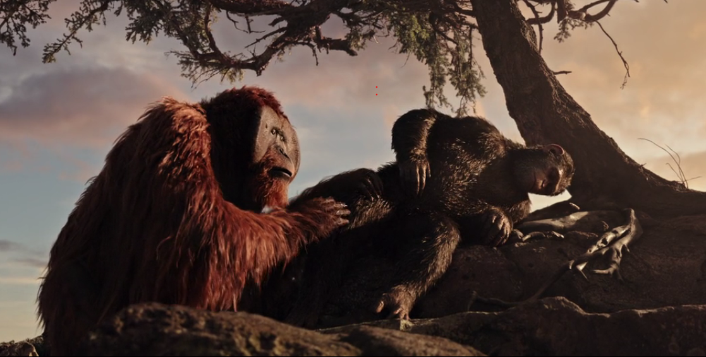
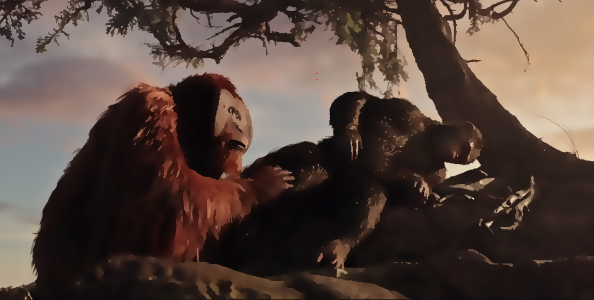
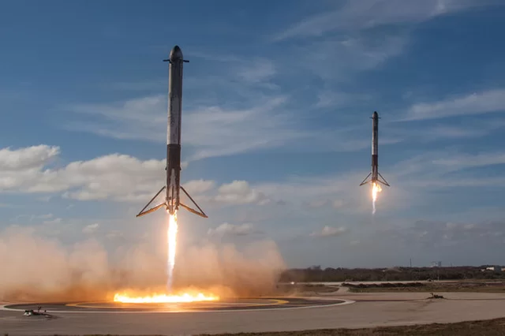

<h2>Oil paint it</h2>
<p>A tool to turn Pictures into Oil paintings</p>
<p>using bilateral filter to flatinize the image and preserve the edges</p>

<div>
    
    
</div>
<div>
    
    
</div>
<div>
    
    
</div>

<h3>how to use</h3>
in shell

```
python BLF.py imagePath
```
imagePath can be `pic.jpg` if in the same folder or `folderName/pic.jpg`

can also use wildcards like * for large number of image converions at once
eg: `images/*.png` for all the images of type png in the images folder

works with any image filetype and can take many images as argements `images/*.*`

